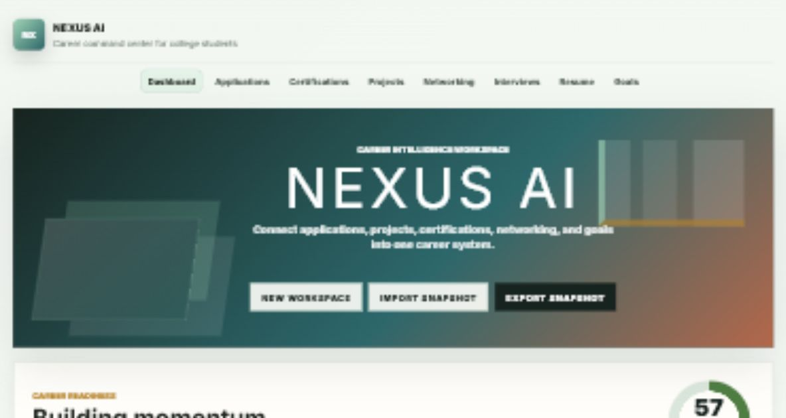

# Nexus AI



Nexus AI is a student career operating system for ambitious college students. It brings applications, certifications, projects, networking, interview preparation, resume notes, goals, and coaching into one organized dashboard.

## Live Demo

[Open Nexus AI](https://jasonbinong.github.io/Nexus-AI/)

## What It Does

Nexus AI helps students manage the full career-building process instead of tracking everything across scattered notes, spreadsheets, and tabs. It is built around repeatable workflows: apply, follow up, improve skills, prepare for interviews, update projects, and monitor progress over time.

## Features

- Personalized career readiness dashboard
- Working FastAPI + SQLite backend in `backend/`
- Frontend can automatically connect to the backend during local development
- Editable internship application tracker with search and status filtering
- Certification tracker with progress monitoring
- Project portfolio tracker with links, tech stacks, and impact notes
- Networking CRM with follow-up dates and context notes
- Interview prep tracker with role-specific practice prompts
- Resume notes and resume coaching checklist
- Semester career goals
- AI-style coaching generated from live workspace data
- Upcoming deadline timeline
- Pipeline analytics
- Career profile setup
- Skill inventory with proof-backed confidence scoring
- Target-role skill gap analysis
- Database-ready workspace schema preview
- Downloadable SQL schema for backend/database planning
- Backend endpoints for workspace data, readiness analytics, and skill-gap analysis
- Workspace reset and JSON snapshot import through the API
- Downloadable career action plan
- Local browser persistence with localStorage
- Importable and exportable JSON snapshots
- Downloadable resume notes
- Blank workspace reset

## Tech Stack

- HTML
- CSS
- JavaScript
- Browser localStorage
- Python
- FastAPI
- SQLite

## What This Project Shows

- Product thinking for student productivity and career management
- Dashboard UX design for repeated daily use
- Local data persistence and import/export workflows
- Backend API design for career-workspace data
- Relational database modeling with SQLite
- Full-stack integration between a JavaScript dashboard and FastAPI service
- Skill gap analysis tied to target roles
- Database schema planning for a future backend
- Systems analysis across applications, skills, networking, and goals

## Portfolio Materials

- [Demo script](DEMO_SCRIPT.md)
- [Roadmap](ROADMAP.md)
- [Ready-to-create GitHub issues](GITHUB_ISSUES.md)
- [LinkedIn post draft](LINKEDIN_POST.md)

## Case Study

### Problem

College students often manage career preparation across disconnected tools: job boards, notes apps, spreadsheets, resumes, project folders, and calendar reminders. This makes it difficult to see whether they are actually becoming more internship-ready over time.

### Solution

Nexus AI centralizes the student career workflow into one dashboard. It helps users track applications, certifications, projects, networking, interviews, resume notes, goals, and skills while generating career-readiness signals from the workspace data.

### Key Design Decisions

- Started with a blank user workspace so each student builds their own profile
- Used localStorage so the app works as a deployable static product on GitHub Pages
- Added a separate FastAPI backend so the project can evolve into a full-stack product without breaking the static demo
- Added skill-gap analysis so the dashboard does more than store information
- Included a SQL schema export to show how the product could evolve into a backend/database system

### What I Learned

This project strengthened my understanding of product design, state management, user workflows, and systems analysis. It also helped me think about how career preparation can be modeled as connected data instead of isolated tasks.

### Future Improvements

- Add user authentication
- Move saved workspace data from SQLite into PostgreSQL
- Add user accounts and role-based access
- Connect CareerLens AI recommendations directly into the Nexus AI skills plan

## How To Run

Open `index.html` in a browser.

No installation is required.

## Backend API

The backend is optional for the GitHub Pages demo, but it is included for the full-stack version of the project.

```bash
cd backend
python -m venv .venv
.venv\Scripts\activate
pip install -r requirements.txt
python seed.py
uvicorn main:app --reload
```

Then open:

```text
http://127.0.0.1:8000/docs
```

Run the frontend at the same time:

```bash
cd ..
python -m http.server 8070
```

Then open:

```text
http://127.0.0.1:8070/
```

When the backend is running, the app shows `API connected` and stores workspace data in SQLite. On GitHub Pages, it safely falls back to browser localStorage.

To verify the SQLite schema before installing API dependencies:

```bash
cd backend
python smoke_test.py
```

To test the API contract after installing dependencies:

```bash
pytest test_api_contract.py
```
