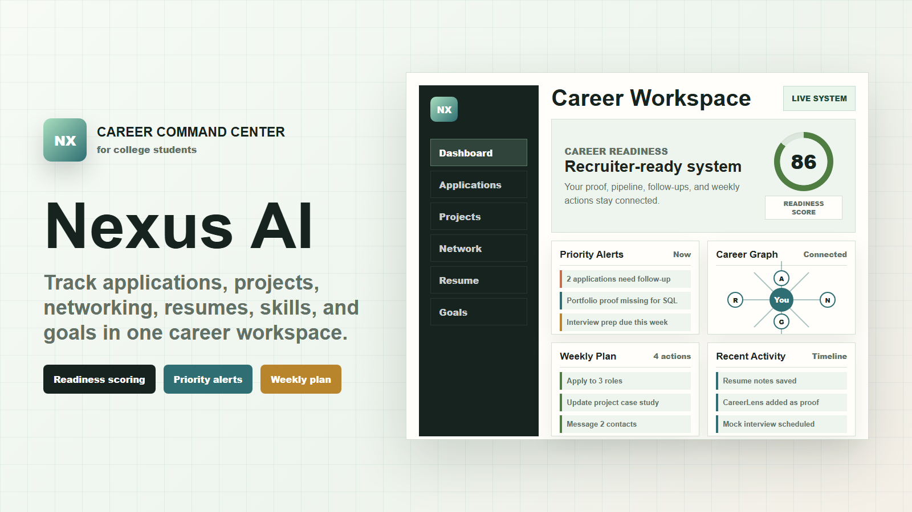
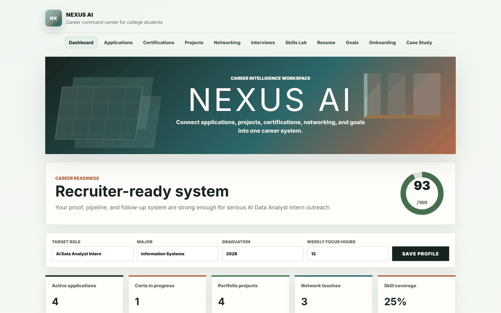

# Nexus AI



Nexus AI is a student career operating system for college students preparing for internships, fellowships, and early-career opportunities. It brings applications, certifications, projects, networking, interview prep, resume notes, goals, readiness scoring, and coaching into one organized workspace.

## IBM SkillsBuild AI Builders Challenge

Nexus AI is being prepared as a July 2026 IBM SkillsBuild AI Builders Challenge submission. The challenge version frames Nexus as an AI-assisted career readiness coach for students.

Challenge materials:

- [IBM AI Builders Submission Notes](IBM_AI_BUILDERS_SUBMISSION.md)
- [IBM Demo Video Script](IBM_DEMO_VIDEO_SCRIPT.md)
- [IBM Submission Checklist](IBM_SUBMISSION_CHECKLIST.md)

Challenge pitch:

> Nexus AI helps college students turn scattered internship preparation into a trackable career workspace with readiness scoring, skill-gap analysis, priority alerts, and weekly next actions.

## Live Links

- [Live App](https://jasonbinong.github.io/Nexus-AI/)
- [Live App With Render Backend](https://jasonbinong.github.io/Nexus-AI/?api=https%3A%2F%2Fnexus-ai-api-upkl.onrender.com)
- [Backend Health Check](https://nexus-ai-api-upkl.onrender.com/health)
- [Portfolio Case Study](https://jasonbinong.github.io/nexus-case-study.html)
- [Portfolio](https://jasonbinong.github.io/)

## Problem

Students often manage career preparation across scattered tools: job boards, spreadsheets, notes apps, resume drafts, calendar reminders, saved links, and disconnected advice. That makes it hard to know what is urgent, what proof is missing, and what to do next.

Nexus AI turns that scattered workflow into a single dashboard where a student can track progress, save evidence, compare readiness, and generate a weekly action plan.

## What It Does

- Starts every new user with a blank workspace and guided onboarding
- Lets users optionally load generic demo data for exploration
- Tracks applications, certifications, projects, networking, interviews, skills, goals, and resume notes
- Scores career readiness from workspace activity and proof
- Compares saved skills against a target role
- Generates priority alerts for overdue items, thin pipelines, missing project links, and role-fit gaps
- Produces weekly action plans with priority, reason, timing, and next steps
- Exports and imports workspace snapshots as JSON
- Connects a GitHub Pages frontend to an optional FastAPI backend on Render

## Privacy And First-Run Behavior

Nexus AI should never open with a real person's profile as the default workspace.

- New users start with blank profile fields
- Name, email, major, target role, graduation, and weekly hours are not prefilled
- Demo data only appears after clicking `Load Demo Data`
- Local mode stores data in the user's browser with `localStorage`
- Backend mode syncs workspace data only when the Render API is selected or detected
- The live backend reset endpoint clears the shared demo workspace

## Project Snapshot

| Area | Details |
| --- | --- |
| Status | Flagship portfolio product and startup exploration |
| Users | College students preparing for internships and early-career roles |
| Frontend | HTML, CSS, JavaScript, localStorage |
| Backend | Python, FastAPI, SQLite |
| Deployment | GitHub Pages frontend, Render backend |
| Core Product Value | Career workspace, readiness scoring, and next-step planning |

## Demo Walkthrough



## Feature Modules

| Module | Purpose |
| --- | --- |
| Dashboard | Shows readiness score, alerts, recent activity, deadlines, and next actions |
| Onboarding | Helps a first-time user set target role, major, graduation, weekly focus hours, and primary goal |
| Applications | Tracks company, role, status, deadline, link, and next action |
| Certifications | Tracks provider, progress, target date, and credential links |
| Projects | Stores project stack, stage, public links, and impact statements |
| Networking | Tracks people, organizations, status, follow-up dates, and message context |
| Interviews | Tracks target roles, companies, interview type, date, and practice focus |
| Skills Lab | Stores skills, confidence levels, categories, and proof |
| Resume | Saves resume notes and generates coaching suggestions from workspace data |
| Goals | Tracks career goals, categories, progress, deadlines, and next steps |
| Case Study | Documents the product problem, system design, roadmap, and build evidence |

## Architecture

```text
GitHub Pages frontend
  |
  | optional API connection
  v
FastAPI backend on Render
  |
  v
SQLite workspace database
```

The app works in two modes:

- `Local mode`: uses browser `localStorage` and can be opened directly from GitHub Pages.
- `API mode`: connects to the Render backend for CRUD operations, readiness analytics, reports, import/export, and reset.

## Backend API

| Method | Endpoint | Purpose |
| --- | --- | --- |
| `GET` | `/health` | Verify API status, version, configured origins, and collections |
| `GET` | `/snapshot` | Return full workspace state |
| `GET` | `/analytics/readiness` | Return readiness score and target-role skill gap analysis |
| `GET` | `/workspace/report` | Return backend-generated summary, alerts, weekly actions, readiness, and skill gaps |
| `PUT` | `/profile` | Update profile fields |
| `PUT` | `/resume` | Update saved resume notes |
| `GET` | `/{collection}` | List records in a workspace collection |
| `POST` | `/{collection}` | Create a record |
| `PUT` | `/{collection}/{item_id}` | Edit a record |
| `DELETE` | `/{collection}/{item_id}` | Delete a record |
| `POST` | `/workspace/import` | Import a JSON workspace snapshot |
| `DELETE` | `/workspace/reset` | Clear the workspace |

Supported collections: `applications`, `certifications`, `projects`, `skills`, `networking`, `interviews`, and `goals`.

## Tech Stack

- HTML
- CSS
- JavaScript
- Python
- FastAPI
- SQLite
- Render
- GitHub Pages

## What Reviewers Should Notice

- Full-stack product direction with a usable frontend and deployed backend
- Blank first-run workflow instead of personal default data
- CRUD API design for career-workspace collections
- Relational data modeling with SQLite
- Readiness analytics tied to applications, skills, projects, goals, networking, and deadlines
- Product thinking around student career workflows
- Clear roadmap toward authentication, PostgreSQL, private accounts, and real AI coaching

## Run Locally

Open the static app:

```bash
python -m http.server 8070
```

Then visit:

```text
http://127.0.0.1:8070/
```

Run the backend:

```bash
cd backend
python -m venv .venv
.venv\Scripts\activate
pip install -r requirements.txt
uvicorn main:app --reload
```

Then visit:

```text
http://127.0.0.1:8000/docs
```

Use the frontend with the local API:

```text
http://127.0.0.1:8070/?api=http://127.0.0.1:8000
```

## Tests And Checks

Run the backend API contract test:

```bash
python -m pytest backend/test_api_contract.py
```

Run the SQLite smoke test:

```bash
python backend/smoke_test.py
```

Check the deployed backend:

```text
https://nexus-ai-api-upkl.onrender.com/health
```

## Portfolio Materials

- [Architecture](ARCHITECTURE.md)
- [Deployment Guide](DEPLOYMENT.md)
- [Auth and PostgreSQL Plan](AUTH_POSTGRESQL_PLAN.md)
- [Roadmap](ROADMAP.md)
- [Demo Script](DEMO_SCRIPT.md)
- [Demo Video Script](DEMO_VIDEO_SCRIPT.md)
- [Resume Entry](RESUME_ENTRY.md)
- [Security Policy](SECURITY.md)
- [Privacy Notes](PRIVACY.md)

## Roadmap

- Add authentication with Clerk or Firebase
- Move production persistence from SQLite to PostgreSQL
- Add private user accounts and role-based access controls
- Connect CareerLens recommendations into Nexus skill planning
- Add LLM-powered resume feedback and weekly coaching
- Add frontend unit tests and broader backend coverage
- Add mentor/peer feedback workflows
